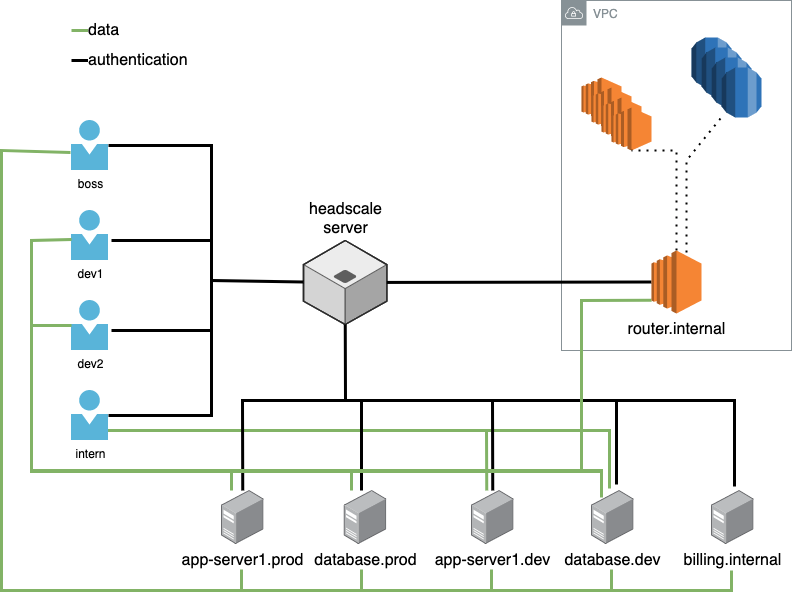

Headscale 实现了与 Tailscale.com 相同的策略 ACL，经过调整以适应自托管环境。

例如，在定义组时，必须使用用户（相当于 Tailscale.com 中的用户/登录信息）。

有关更多信息，请查看 [这篇文章](https://tailscale.com/kb/1018/acls/)。

在使用 ACL 时，用户边界不再适用。所有机器，无论属于哪个用户，只要 ACL 允许，就可以与其他主机进行通信。

## ACL 使用案例示例

让我们为一家小型企业构建一个示例用例（这是 ACL 最有用的地方）。

我们有一家公司，有一位老板、一位管理员、两名开发人员和一名实习生。

- **老板**应有权访问所有服务器，但不能访问用户的主机。
- **管理员**同样应有权访问所有主机，但权限应限制在维护主机上（仅供示例）。
- **开发人员**可以在开发主机上执行任何操作，但只能在生产主机上进行查看。
- **实习生**只能与开发服务器进行交互。

此外，还有一个额外的服务器作为路由器，将 VPN 用户连接到内部网络 `10.20.0.0/16`。开发人员必须能够访问这些内部资源。

每个用户至少有一台设备连接到网络，我们有一些服务器：

- database.prod
- database.dev
- app-server1.prod
- app-server1.dev
- billing.internal
- router.internal



## ACL 设置

ACL 必须使用 [huJSON](https://github.com/tailscale/hujson) 编写。

在 [注册服务器时](../usage/getting-started.md#register-a-node)，我们需要添加标志 `--advertise-tags=tag:<tag1>,tag:<tag2>`，注册服务器的用户必须被允许执行此操作。由于任何人都可以将标签添加到他们可以注册的服务器，因此标签的检查是在 headscale 服务器上完成的，只有有效的标签才会被应用。如果注册标签的用户被允许执行此操作，则该标签是有效的。

要在 Headscale 中使用 ACL，您必须编辑您的 `config.yaml` 文件。在该文件中，您会找到一个 `policy.path` 参数。该参数需要指向您的 ACL 文件。有关这些策略的编写方式的更多信息，请参见 [这里](https://tailscale.com/kb/1018/acls/)。

在更新 ACL 文件后，请重新加载或重启 Headscale。可以通过其 systemd 服务重新加载 Headscale（`sudo systemctl reload headscale`）或向主进程发送 SIGHUP 信号（`sudo kill -HUP $(pidof headscale)`）。Headscale 会在每次重新加载后记录 ACL 策略处理的结果。

以下是实现与上述相同权限的 ACL：

```json title="acl.json"
{
 // groups 是具有共同范围的用户集合。用户可以属于多个组。
// 组不能由其他组组成
 "groups": {
 "group:boss": ["boss"],
 "group:dev": ["dev1", "dev2"],
 "group:admin": ["admin1"],
 "group:intern": ["intern1"]
 },
 // tagOwners 在 tailscale 中是标签和被允许在服务器上设置该标签的人员之间的关系。
// 这在 [这里](https://tailscale.com/kb/1068/acl-tags#defining-a-tag) 有详细的说明
// 并在 [这里](https://tailscale.com/blog/rbac-like-it-was-meant-to-be/) 进行了阐释
 "tagOwners": {
 // 管理员可以添加生产中的服务器
 "tag:prod-databases": ["group:admin"],
 "tag:prod-app-servers": ["group:admin"],

 // 老板可以将任何服务器标记为内部
 "tag:internal": ["group:boss"],

 // 开发人员可以添加用于开发目的的服务器，以及管理员
 "tag:dev-databases": ["group:admin", "group:dev"],
 "tag:dev-app-servers": ["group:admin", "group:dev"]

 // 实习生无法添加服务器
 },
 // 主机应使用其 IP 地址和子网掩码定义。
// 要定义单个主机，请使用 /32 掩码。此处不能使用 DNS 条目，
// 因为它们容易被通过替换其 IP 地址进行劫持。
// 有关更多信息，请参见 https://github.com/tailscale/tailscale/issues/3800。
 "hosts": {
 "postgresql.internal": "10.20.0.2/32",
 "webservers.internal": "10.20.10.1/29"
 },
 "acls": [
 // 老板可以访问所有服务器
 {
 "action": "accept",
 "src": ["group:boss"],
 "dst": [
 "tag:prod-databases:*",
 "tag:prod-app-servers:*",
 "tag:internal:*",
 "tag:dev-databases:*",
 "tag:dev-app-servers:*"
 ]
 },

 // 管理员仅能访问服务器的管理端口，tcp/22
 {
 "action": "accept",
 "src": ["group:admin"],
 "proto": "tcp",
 "dst": [
 "tag:prod-databases:22",
 "tag:prod-app-servers:22",
 "tag:internal:22",
 "tag:dev-databases:22",
 "tag:dev-app-servers:22"
 ]
 },

 // 我们还允许管理员 ping 服务器
 {
 "action": "accept",
 "src": ["group:admin"],
 "proto": "icmp",
 "dst": [
 "tag:prod-databases:*",
 "tag:prod-app-servers:*",
 "tag:internal:*",
 "tag:dev-databases:*",
 "tag:dev-app-servers:*"
 ]
 },

 // 开发人员可以访问数据库服务器和应用程序服务器的所有端口
 // 他们只能查看生产环境的应用程序服务器，无法访问生产环境的数据库服务器
 {
 "action": "accept",
 "src": ["group:dev"],
 "dst": [
 "tag:dev-databases:*",
 "tag:dev-app-servers:*",
 "tag:prod-app-servers:80,443"
 ]
 },
 // 开发人员通过路由器访问内部网络。
// 内部网络由 HTTPS 端点和 PostgreSQL
// 数据库服务器组成。还有一条额外的规则允许流量被转发到
// 内部子网 10.20.0.0/16。请参见此问题
// https://github.com/juanfont/headscale/issues/502
 {
 "action": "accept",
 "src": ["group:dev"],
 "dst": ["10.20.0.0/16:443,5432", "router.internal:0"]
 },

 // 服务器应能够通过 tcp/5432 与数据库通信。数据库不应能够发起连接到
 // 应用程序服务器
 {
 "action": "accept",
 "src": ["tag:dev-app-servers"],
 "proto": "tcp",
 "dst": ["tag:dev-databases:5432"]
 },
 {
 "action": "accept",
 "src": ["tag:prod-app-servers"],
 "dst": ["tag:prod-databases:5432"]
 },

 // 实习生仅在阅读模式下访问开发应用程序服务器
 {
 "action": "accept",
 "src": ["group:intern"],
 "dst": ["tag:dev-app-servers:80,443"]
 },

 // 我们仍然需要允许内部用户之间的通信，因为没有任何东西可以保证每个用户都有
 // 自己的用户。
 { "action": "accept", "src": ["boss"], "dst": ["boss:*"] },
 { "action": "accept", "src": ["dev1"], "dst": ["dev1:*"] },
 { "action": "accept", "src": ["dev2"], "dst": ["dev2:*"] },
 { "action": "accept", "src": ["admin1"], "dst": ["admin1:*"] },
 { "action": "accept", "src": ["intern1"], "dst": ["intern1:*"] }
 ]
}
```

